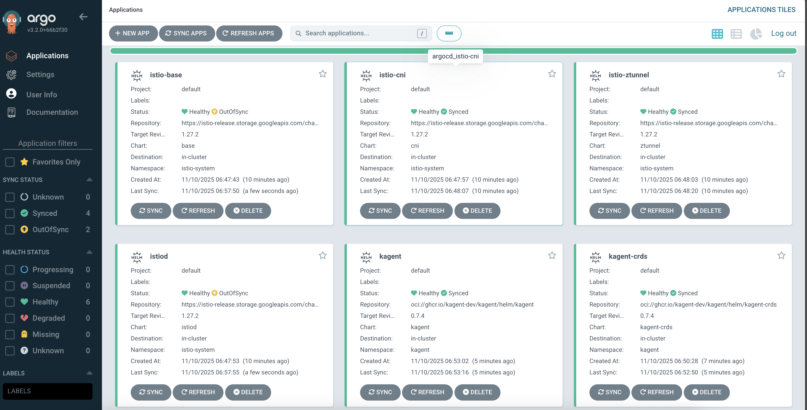
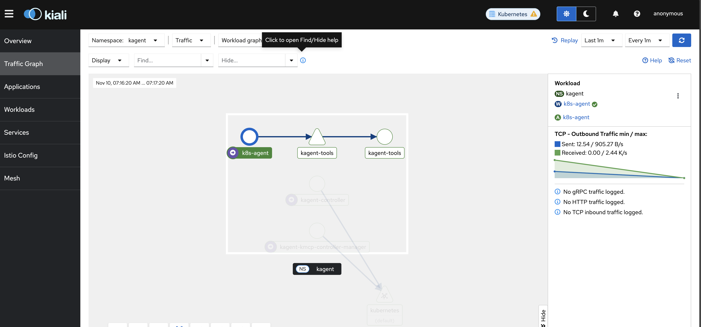

# kagent + Ambient Mesh For Resilience

## Cluster Config

If you want a demo cluster in GKE, you can use the HCL in **kagent-oss-gke**

## GitOps Setup

```
helm repo add argo https://argoproj.github.io/argo-helm
```

```
helm install argocd -n argocd argo/argo-cd \
--set redis-ha.enabled=true \
--set controller.replicas=1 \
--set server.autoscaling.enabled=true \
--set server.autoscaling.minReplicas=2 \
--set repoServer.autoscaling.enabled=true \
--set repoServer.autoscaling.minReplicas=2 \
--set applicationSet.replicaCount=2 \
--set server.service.type=LoadBalancer \
--create-namespace
```

```
kubectl get secret -n argocd argocd-initial-admin-secret -o jsonpath="{.data.password}" | base64 -d
```

```
argocd login lb_ip_address
```

## Ambient Mesh Configuration

```
export ISTIO_VERSION=1.27.2
```

```
kubectl apply -f- <<EOF
apiVersion: argoproj.io/v1alpha1
kind: Application
metadata:
  name: istio-base
  namespace: argocd
spec:
  destination:
    server: https://kubernetes.default.svc
    namespace: istio-system
  project: default
  source:
    chart: base
    repoURL: https://istio-release.storage.googleapis.com/charts
    targetRevision: "${ISTIO_VERSION}"
  syncPolicy:
    automated:
      prune: true
      selfHeal: true
    syncOptions:
    - CreateNamespace=true
EOF
```

```
kubectl apply -f- <<EOF
apiVersion: argoproj.io/v1alpha1
kind: Application
metadata:
  name: istiod
  namespace: argocd
spec:
  destination:
    server: https://kubernetes.default.svc
    namespace: istio-system
  project: default
  source:
    chart: istiod
    repoURL: https://istio-release.storage.googleapis.com/charts
    targetRevision: ${ISTIO_VERSION}
    helm:
      values: |
        profile: ambient
  syncPolicy:
    automated:
      prune: true
      selfHeal: true
  ignoreDifferences:
  - group: admissionregistration.k8s.io
    kind: ValidatingWebhookConfiguration
EOF
```

```
kubectl apply -f- <<EOF
apiVersion: argoproj.io/v1alpha1
kind: Application
metadata:
  name: istio-cni
  namespace: argocd
spec:
  destination:
    server: https://kubernetes.default.svc
    namespace: istio-system
  project: default
  source:
    chart: cni
    repoURL: https://istio-release.storage.googleapis.com/charts
    targetRevision: ${ISTIO_VERSION}
    helm:
      values: |
        profile: ambient
        cni:
          cniBinDir: /home/kubernetes/bin
  syncPolicy:
    automated:
      prune: true
      selfHeal: true
EOF
```

```
kubectl apply -f- <<EOF
apiVersion: argoproj.io/v1alpha1
kind: Application
metadata:
  name: istio-ztunnel
  namespace: argocd
spec:
  destination:
    server: https://kubernetes.default.svc
    namespace: istio-system
  project: default
  source:
    chart: ztunnel
    repoURL: https://istio-release.storage.googleapis.com/charts
    targetRevision: ${ISTIO_VERSION}
    helm:
      values: |
        global:
          platform: gke
  syncPolicy:
    automated:
      prune: true
      selfHeal: true
EOF
```

```
kubectl logs -n istio-system -l app=ztunnel
```

## kagent Installation

```
export ANTHROPIC_API_KEY=
```

```
kubectl apply -f- <<EOF
apiVersion: argoproj.io/v1alpha1
kind: Application
metadata:
  name: kagent-crds
  namespace: argocd
spec:
  destination:
    server: https://kubernetes.default.svc
    namespace: kagent
  project: default
  source:
    chart: kagent-crds
    repoURL: oci://ghcr.io/kagent-dev/kagent/helm/kagent-crds
    targetRevision: "0.7.4"
  syncPolicy:
    automated:
      prune: true
      selfHeal: true
    syncOptions:
    - CreateNamespace=true
EOF
```

```
kubectl apply -f- <<EOF
apiVersion: argoproj.io/v1alpha1
kind: Application
metadata:
  name: kagent
  namespace: argocd
spec:
  destination:
    server: https://kubernetes.default.svc
    namespace: kagent
  project: default
  source:
    chart: kagent
    repoURL: oci://ghcr.io/kagent-dev/kagent/helm/kagent
    targetRevision: "0.7.4"
    helm:
      values: |
        providers:
          default: anthropic
          anthropic:
            apiKey: $ANTHROPIC_API_KEY
        ui:
          service:
            type: LoadBalancer
  syncPolicy:
    automated:
      prune: true
      selfHeal: true
EOF
```



## Observability Config
```
helm repo add prometheus-community https://prometheus-community.github.io/helm-charts
```

```
helm repo update
```

```
helm install kube-prometheus -n monitoring prometheus-community/kube-prometheus-stack --create-namespace
```

To build a dashboard with the metrics
```
kubectl --namespace monitoring port-forward svc/kube-prometheus-grafana 3000:80
```

To log into the Grafana UI:

1. Username: admin
2. Password: OYD6d5kegTNezxlJSWZyIOfwXmBDxn9XarTpJRbZ

### Ambient
```
kubectl apply -f - <<EOF
apiVersion: monitoring.coreos.com/v1
kind: ServiceMonitor
metadata:
  name: istiod
  namespace: monitoring
  labels:
    release: kube-prometheus  # Required for Prometheus to discover this ServiceMonitor
spec:
  selector:
    matchLabels:
      app: istiod
  namespaceSelector:
    matchNames:
      - istio-system
  endpoints:
  - port: http-monitoring
    interval: 30s
    path: /metrics
EOF
```

```
kubectl apply -f - <<EOF
apiVersion: monitoring.coreos.com/v1
kind: PodMonitor
metadata:
  name: ztunnel
  namespace: monitoring
  labels:
    release: kube-prometheus  # Required for Prometheus to discover this PodMonitor
spec:
  selector:
    matchLabels:
      app: ztunnel
  namespaceSelector:
    matchNames:
      - istio-system
  podMetricsEndpoints:
  - port: ztunnel-stats
    interval: 30s
    path: /stats/prometheus
EOF
```

## Diving Into kagent

The configuration below deploys an Nginx Pod, but notice how the image name is wrong. Instead of the tag being latest, it's latesttt, which means the deployment will fail.

1. Deploy the below Manifest. It will fail, but that is on purpose.
```
kubectl apply -f - <<EOF
apiVersion: v1
kind: Pod
metadata:
  name: ngi14
spec:
  containers:
  - name: nginx
    image: nginx:latesttttt
    ports:
    - containerPort: 80
EOF
```

2. Open up kagent and go to the pre-built k8s-agent Agent.

3. Prompt the Agent by saying :
```
Why is the Nginx Pod failing in my default namespace?
```

4. You'll notice that kagent goes through several steps to not only debug the issue, but fix it.

## Ambient & Kiali Configuration
1. Label the kagent Namespace for Ambient
```
kubectl label namespace kagent istio.io/dataplane-mode=ambient
```

2. Add Kiali
```
helm repo add kiali https://kiali.org/helm-charts
helm repo update
```

3. Install Kiali
```
helm install kiali-server kiali/kiali-server \
  -n istio-system \
  --set auth.strategy="anonymous" \
  --set external_services.prometheus.url="http://kube-prometheus-kube-prome-prometheus.monitoring.svc.cluster.local:9090"
```

4. Access Kiali
```
kubectl port-forward -n istio-system svc/kiali 20001:20001
```



## Load Generation

Now that we have Ambient Mesh installed, Observability in place, and kagent configured, let's put it to the test. We're going to ask kagent to help us generate a load testing tool and then fix any issues that occur.

We'll stress test kagent's self-healing capabilities under realistic production load.

1. Deploy a sample web application with an intentional misconfiguration:
```
kubectl apply -f - <<EOF
apiVersion: apps/v1
kind: Deployment
metadata:
  name: demo-app
  namespace: default
spec:
  replicas: 3
  selector:
    matchLabels:
      app: demo-app
  template:
    metadata:
      labels:
        app: demo-app
    spec:
      containers:
      - name: demo-app
        image: nginx:latesttttt  # Intentional typo
        ports:
        - containerPort: 80
        resources:
          limits:
            memory: "10Mi"  # Intentionally too low
            cpu: "10m"
---
apiVersion: v1
kind: Service
metadata:
  name: demo-app
  namespace: default
spec:
  selector:
    app: demo-app
  ports:
  - port: 80
    targetPort: 80
EOF
```

2. Deploy Fortio as a load generator:
```
kubectl apply -f - <<EOF
apiVersion: v1
kind: Pod
metadata:
  name: fortio
  namespace: default
spec:
  containers:
  - name: fortio
    image: fortio/fortio:latest
    command: ["fortio"]
    args: ["server"]
EOF
```

3. Wait for the Fortio pod to be ready:
```
kubectl wait --for=condition=ready pod/fortio -n default --timeout=60s
```

4. Start generating load with Fortio (run this in a separate terminal):
```
kubectl exec -it fortio -n default -- fortio load -c 50 -qps 100 -t 5m http://demo-app.default.svc.cluster.local
```

5. While the load test is running, open kagent and prompt the k8s-agent:
```
The demo-app deployment in the default namespace is failing. Can you investigate and fix all issues?
```

6. Watch kagent autonomously:
   - Detect the image pull error (nginx:latesttttt)
   - Fix the image tag to nginx:latest
   - Identify the insufficient memory limits
   - Adjust resource limits appropriately
   - Monitor pod recovery

7. Observe the Fortio output showing error rates decrease as kagent fixes the issues in real-time.

This demonstrates kagent's AI-powered self-healing under sustained production load, showcasing autonomous problem detection and resolution while traffic continues flowing.


## Securing LLM Connectivity

### Installing agentgateway

```
kubectl apply -f https://github.com/kubernetes-sigs/gateway-api/releases/download/v1.4.0/standard-install.yaml
```

```
kubectl apply -f- <<EOF
apiVersion: argoproj.io/v1alpha1
kind: Application
metadata:
  name: kgateway-crds
  namespace: argocd
spec:
  destination:
    server: https://kubernetes.default.svc
    namespace: kgateway-system
  project: default
  source:
    chart: kgateway-crds
    repoURL: oci://cr.kgateway.dev/kgateway-dev/charts/kgateway-crds
    targetRevision: v2.1.1
    helm:
      values: |
        controller:
          image:
            pullPolicy: Always
  syncPolicy:
    automated:
      prune: true
      selfHeal: true
    syncOptions:
      - CreateNamespace=true
EOF
```

```
kubectl apply -f- <<EOF
apiVersion: argoproj.io/v1alpha1
kind: Application
metadata:
  name: kgateway
  namespace: argocd
spec:
  destination:
    server: https://kubernetes.default.svc
    namespace: kgateway-system
  project: default
  source:
    chart: kgateway
    repoURL: oci://cr.kgateway.dev/kgateway-dev/charts/kgateway
    targetRevision: v2.1.1
    helm:
      values: |
        controller:
          image:
            pullPolicy: Always
        agentgateway:
          enabled: true
        gateway:
          aiExtension:
            enabled: true
  syncPolicy:
    automated:
      prune: true
      selfHeal: true
EOF
```

### Claude LLM Rate Limiting

1. Create env variable for Anthropic key

```
export ANTHROPIC_API_KEY=
```

2. Create a secret to store the Claude API key
```
kubectl apply -f- <<EOF
apiVersion: v1
kind: Secret
metadata:
  name: anthropic-secret
  namespace: kgateway-system
  labels:
    app: agentgateway
type: Opaque
stringData:
  Authorization: $ANTHROPIC_API_KEY
EOF
```

3. Create a Gateway for Anthropic

A `Gateway` resource is used to trigger kgateway to deploy agentgateway data plane Pods

The Agentgateway data plane Pod is the Pod that gets created when a Gateway object is created in a Kubernetes environment where Agentgateway is deployed as the Gateway API implementation.
```
kubectl apply -f- <<EOF
kind: Gateway
apiVersion: gateway.networking.k8s.io/v1
metadata:
  name: agentgateway
  namespace: kgateway-system
  labels:
    app: agentgateway
spec:
  gatewayClassName: agentgateway
  listeners:
  - protocol: HTTP
    port: 8080
    name: http
    allowedRoutes:
      namespaces:
        from: All
EOF
```

4. Create a `Backend` object 

A Backend resource to define a backing destination that you want kgateway to route to. In this case, it's Claude.
```
kubectl apply -f- <<EOF
apiVersion: gateway.kgateway.dev/v1alpha1
kind: Backend
metadata:
  labels:
    app: agentgateway
  name: anthropic
  namespace: kgateway-system
spec:
  type: AI
  ai:
    llm:
        anthropic:
          authToken:
            kind: SecretRef
            secretRef:
              name: anthropic-secret
          model: "claude-3-5-haiku-latest"
EOF
```

5. Ensure everything is running as expected
```
kubectl get backend -n kgateway-system
```

5. Apply the Route so you can reach the LLM
```
kubectl apply -f- <<EOF
apiVersion: gateway.networking.k8s.io/v1
kind: HTTPRoute
metadata:
  name: claude
  namespace: kgateway-system
  labels:
    app: agentgateway
spec:
  parentRefs:
    - name: agentgateway
      namespace: kgateway-system
  rules:
  - matches:
    - path:
        type: PathPrefix
        value: /anthropic
    filters:
    - type: URLRewrite
      urlRewrite:
        path:
          type: ReplaceFullPath
          replaceFullPath: /v1/chat/completions
    backendRefs:
    - name: anthropic
      namespace: kgateway-system
      group: gateway.kgateway.dev
      kind: Backend
EOF
```

6. Create a rate limit rule that targets the `HTTPRoute` you just created
```
kubectl apply -f- <<EOF
apiVersion: gateway.kgateway.dev/v1alpha1
kind: TrafficPolicy
metadata:
  name: anthropic-ratelimit
  namespace: kgateway-system
spec:
  targetRefs:
    - group: gateway.networking.k8s.io
      kind: HTTPRoute
      name: claude
  rateLimit:
    local:
      tokenBucket:
        maxTokens: 1
        tokensPerFill: 1
        fillInterval: 100s
EOF
```

7. Capture the LB IP of the service. This will be used later to send a request to the LLM.
```
export INGRESS_GW_ADDRESS=$(kubectl get svc -n kgateway-system agentgateway -o jsonpath="{.status.loadBalancer.ingress[0]['hostname','ip']}")
echo $INGRESS_GW_ADDRESS
```

8. Test the LLM connectivity
```
curl "$INGRESS_GW_ADDRESS:8080/anthropic" -v \ -H content-type:application/json -H x-api-key:$ANTHROPIC_API_KEY -H "anthropic-version: 2023-06-01" -d '{
  "model": "claude-sonnet-4-5",
  "messages": [
    {
      "role": "system",
      "content": "You are a skilled cloud-native network engineer."
    },
    {
      "role": "user",
      "content": "Write me a paragraph containing the best way to think about Istio Ambient Mesh"
    }
  ]
}' | jq
```

9. Run the `curl` again

You'll see a `curl` error that isn't very helpful. It'll look something like this:

```
curl: (3) URL rejected: Malformed input to a URL function
curl: (3) URL rejected: Port number was not a decimal number between 0 and 65535
jq: parse error: Invalid numeric literal at line 1, column 
```

However, if you check the agentgateway Pod logs, you'll see the rate limit error.

```
kubectl logs -n kgateway-system agentgateway-6b5d688959-25nw9 --tail=50 | grep -i "request\|error\|anthropic"
```

```
2025-10-20T16:08:59.886579Z     info    request gateway=kgateway-system/agentgateway listener=http route=kgateway-system/claude src.addr=10.142.0.25:42187 http.method=POST http.host=34.148.15.158 http.path=/anthropic http.version=HTTP/1.1 http.status=429 error="rate limit exceeded" duration=0ms
```